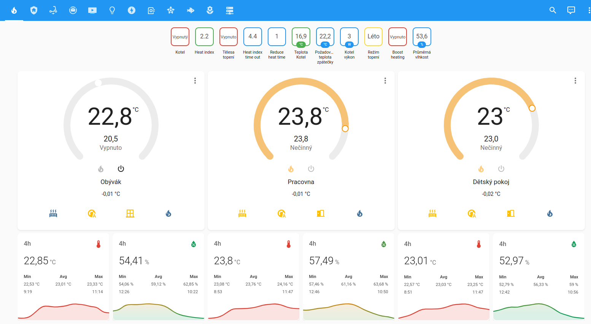
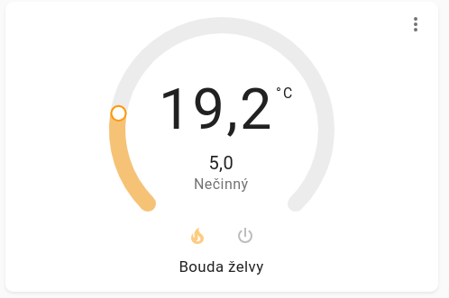
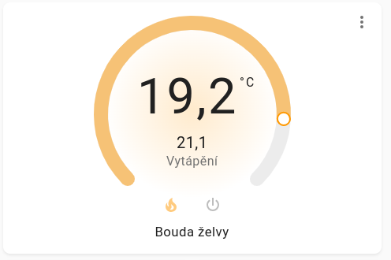

# Home Assistant Theme

## Introduction
Welcome to my custom Home Assistant theme! This theme provides a unique visual experience, leveraging different Material Design colors, to give your Home Assistant a refreshing look. 

## Preview

### Thermostat States
- **Idle State**:
  
- **Heating State**:
  

## Features
1. **Material Design Colors**: Different Material Design colors have been used to revamp the look and feel of Home Assistant.
2. **Restyled Climate Card**: A new version has been introduced, and thermostats in lovelace have been restyled to better match this new design. This design is typically displayed in a modal window, offering an improved user experience.
3. **Restyled Badges**: Unlike the traditional round badges, these are rectangular with rounded corners. These badges are not just aesthetically pleasing but are also functional. Their color changes automatically based on the state of the entity they represent.
4. **Enhanced Borders**: The badges now come with a thicker border, making them stand out and providing a more defined look.

## Installation Requirements
To ensure that this theme works flawlessly, you must have the `card-mod` add-on from HACS installed. 

## Installation via HACS

Follow these steps to install the theme through HACS:

1. **Add Repository to HACS**:
   - Open your Home Assistant and go to the `HACS` section.
   - Click on the "Integrations" tab on the left side.
   - Click on the three dots in the top right corner and select `Custom repositories`.
   - Paste the URL of this repository, e.g. `https://github.com/matata86/ha-fns-theme`, and confirm.
   - From the category dropdown, choose `Themes`.

2. **Install the Theme**:
   - In HACS, under the `Themes` section, find "FNS Material design theme" (or however you've named your theme).
   - Click on it and then press the `Install` button.

3. **Activate the Theme**:
   - After installation, go to Home Assistant's settings (`Configuration` -> `Themes`) and select "FNS Material design theme" from the dropdown menu.

## Install manualy

1. **Download This Theme**: Clone or download this repository to your Home Assistant's `themes` directory.

2. **Activate the Theme**: Go to Home Assistant's user profile settings and under the "Themes" dropdown, select this theme to apply it.

## Support
If you encounter any issues or have any suggestions, please open an issue in this repository. Contributions are also welcome!

## Conclusion
Give your Home Assistant a refreshing look with this custom theme. Enjoy a blend of unique Material Design colors, enhanced badges, and a restyled thermostat card. Your feedback is invaluable, and I hope you enjoy using it as much as I loved creating it!

